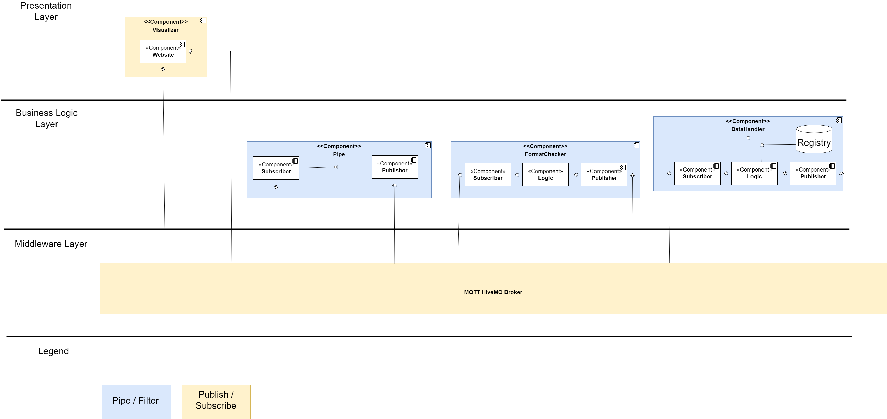
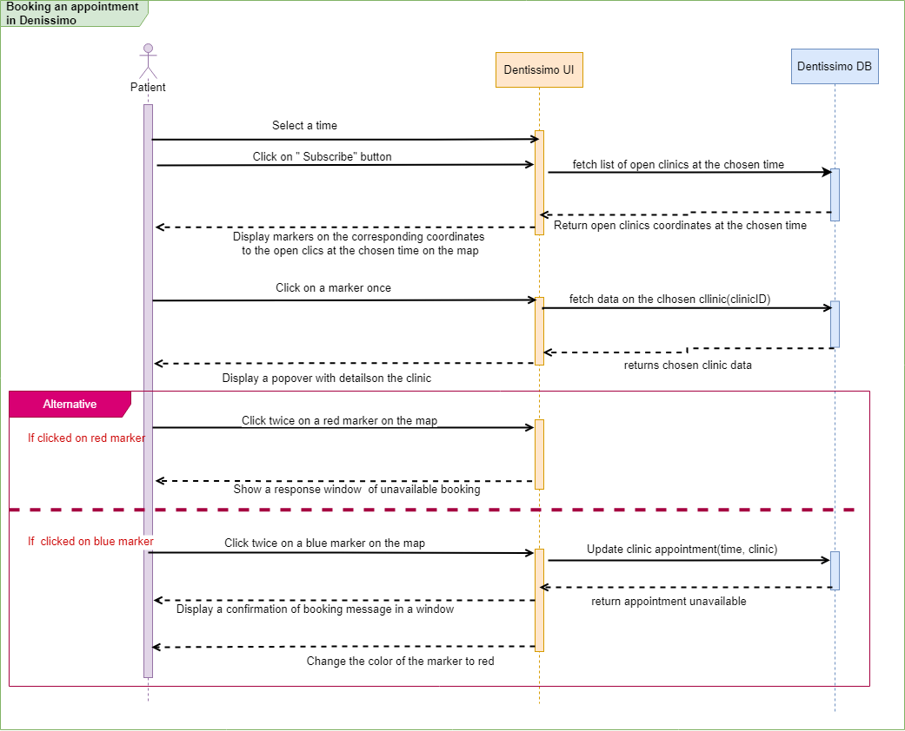

# Dentistimo
[[_TOC_]]

## What?
A software that keeps track of the availaiblity of free time-slots for dentists in Gothenburg, where the client uses a browser-based application to visualize the locations of the dentists and book a specific dentist by clicking on the marker on the map. A confirmation of the booking will be displayed to the client according to the availablity otherwise a rejection will be displayed.

## Why?
In order to automatically get a list of available dentists according to the time window set by the client.

## How?
The visualiser recieves the dentists registry over the MQTT-protocol.

## Project requirements   
 
 
<!-- [ PMR ]() --> 

## Technologies used
*  MQTT with HiveMQ broker
*  MapBox
*  Node.js

## Developers  
[Leila Bencheikh ](https://git.chalmers.se/leilab)  
[Maab Mohammedali ](https://git.chalmers.se/maabm)  
[Mila Mehrvarz ](https://git.chalmers.se/mehrvarz)  
[Muntasir Adam ](https://git.chalmers.se/adammu)  
[Ramzi Abu Zahra ](https://git.chalmers.se/sramzi)  

## Project Development Process   

We have used Agile development methodology for our project management. We have identified the project requirements and broke them down into tasks which we included in the sprint backlog. Furthermore, in our project development process we had sprint planning and sprint review meetings to consolidate the team’s efforts by unifying our vision and demonstrate our results to each other. In addition to defining the nature of our meetings, the team members have been assigned to different roles such as Scrum master, Developers and Product owner (TA) which helped us in organizing our contributions more clearly. During each sprint we set deadlines for the tasks that need to be completed individually, as a subgroup and as team. The communication between team members has been conducted via Discord, Zoom and Slack. In this project, Trello was the main management and planning tool that has been used. Moreover, we decided to use software which allows online collaboration such as Draw.io for creating various software diagrams, and Google drive for easy collaboration on project documents and assignments

## Project Managment tools   

- Trello
- Slack
- Discord
- Google drive
- Draw.io
- Zoom

## Software Architecture style

### Publish-Subscribe Architecture Style

publish/subscribe is one of the architecture style that we have considered to implement in our project in order to exchange messages between two components in our system. In this architecture style one component subscribes to a message that has been
published by a publisher(another Component). The publish and subscribe will make use of the MQTT Paho
technology which is one of the core requirements of the project.

### Pipe and Filter Architecture Style

We decided to use the Publish-Subscribe architecture style and the Pipe-Filter style. Using
the pipe and filter will allow more components to be added later on during the course when
the requirements add up over time

## Diagrams describing our project:

### **Components**  

[ Visualizer ](https://git.chalmers.se/courses/dit355/test-teams-formation/team-8/visualizer)  
[ TimeValidator ](https://git.chalmers.se/courses/dit355/test-teams-formation/team-8/dataHandler)  
[ FormatChecker ](https://git.chalmers.se/courses/dit355/test-teams-formation/team-8/formatChecker)  
[ BookingHandler ](https://git.chalmers.se/courses/dit355/test-teams-formation/team-8/extractData)  
[ RequestGenerator](https://git.chalmers.se/courses/dit355/test-teams-formation/team-8/requestGenerator)  
[ CircuitBreaker](https://git.chalmers.se/courses/dit355/test-teams-formation/team-8/circuitBreaker)  

### Component Diagram
 
<a href="https://viewer.diagrams.net/?tags=%7B%7D&highlight=0000ff&edit=_blank&layers=1&nav=1&page-id=ij3wKR9K-9vH3z9QAgCV&title=Untitled%20Diagram.drawio#R%3Cmxfile%20pages%3D%222%22%3E%3Cdiagram%20id%3D%22RYoHYqzA-rH0tvi_VIS5%22%20name%3D%22Page-1%22%3E7V3tm5q6Ev9r%2FLg%2BhECAj3W3L8%2B9bU97256ee76hoHIWxSLurv3rTxCCJASNK4SIbvvsStAIM795yWRmGMD7xcv72F3NP0WeHw50zXsZwIeBriPbMPCfdGSbjei2aWYjszjwsjFtP%2FAt%2BO1ng4CMbgLPX%2Bdj2VASRWESrOjBSbRc%2BpOEGnPjOHqm3zaNQo8aWLkzvzLwbeKG1dGfgZfMs1Fbt%2FbjH%2FxgNiffDJCTnVm45M35naznrhc9l4bg2wG8j6MoyV4tXu79MKUeTZd3NWeLC4v9ZSLygb%2BfgGuPZ6v%2FPi2BvX374S%2Ft%2B4%2B7fJYnN9zkNzzQUYjnG63SS062OR3Qr016naOFG8%2BC5QC%2BwWfR6gX%2F1kq%2F8RtS%2FvgvyZ0bBrP8fRN8gX5cnJ5Gy%2BRuvWN0elbX04%2BS%2BfGrWf43zP6%2BW7FjalzZmHsVolO4ixV%2BEVaP7qPFKlqmLCXD9EdY6owr1xWfdWHqUz0b%2BB4s%2FD%2FxpJ6bRPEhevDuxQuezifSeQBokle8e97dIhnVqa%2FRc148hP40PR89%2BfE03KmmaYBVBhzNkwX%2B8wBSUsXR6jtmsp%2FqGC2%2FuFxNpzpslH7kPgoxE9K5oef69nSCx9dJHD36pTNoYvvjaXE9ZcVFtJAfY6yUhnJF9t6PFn4Sb%2FFbiGFBdvaR3KzYBsqOn%2Fc62jJyxTsv6edCG7u5XZgVc%2B9VJ36Ra88TNKnO0aQM3bEFWKUvJ4WMw9E%2FfpJsiWWxyUBhUgwOxav0O6jahYkKKiTUeRTMx2I%2FdJPgiTaTPKrm3%2FclClKlRr7sTjcoDhr0BNF0usaQY5lSXPTr%2BQQbtHiH1FutbtuJaauKt%2FHLEld1NbMoYe6ujvB%2FBusNvpDffqsGslXgNMxjlSzldDrVJ1xL6aExMlEzlvIOaRalaKFpV%2FQ85Cp6aNQr9bNMpaGaqYSnUvU6TKVZ5dO9PnhTUtr4cNS0mJ6nM37643WQ%2BHyZZ0B2ivA2IYqmQYuiQY5LOAI2B0hOW04rEpfEReRt0rEWxdA8laKSxZDmniVLDJ3jTIqjzdLzvRy7UZzMo1m0dMOPUbTKEb7jUs4Ud5NEtPHyl96bNFqGD5dYtLORdzsbt5ty%2Fegnkzk5iDbxxP%2Fix3gNjl2bbyt3Eixn%2BclkJ0U1J1lgZKaPgAkckrPsS4%2BjJyFSXLsuyif0PSryVwVZw3gxTQYxORmzTzUPGxJBlYWbuRtO74N4ElbRg3kZb%2F9KD4YmOfx%2F6ZDEfREXEhT2hPWyOjgADmO%2FHV0ICJiw7rb0tlX6hnUrUOGFgRmo4GmC1Trl7fMcG9hUrtMzz7G7oiFBfOZi3eOuV1lkfhq8pFgbxT425O54N3PK0%2FzG8NeYo4H5kCJxk4TBEvvEJKhf0UFnaJITLDY0GYttcyw2x%2BSAtgw24BgD5X2yb5vxehIH47p1aLdumaVDiscOrLoVcr0yXUBzS3TLCszd%2FDKaTRytqbwsftmMw2A9V1MUAbDouL4CsnhCXF%2BCLL6Cptchi5ywvvKy%2BDGaBRMV5dAxlBPDE2KGMsRQ9YhhR2IIBRYSlxqrqJWro5EJgpajS1KYv7HtJSkAENECbiF6jpZjE1DAqvY4NnEcMaJBDHmIsTpGDG%2Ff%2FrJCFA0YZgBMwLCBY5llBiSggGG%2BQo0vLL9IkvwW274FcOBQt%2Fb%2FoFxp5mwt9k%2F%2F%2By9Bks2MLJQfZ1NrwMyPH17IdaQH29JBAdJ87PVoJKpaHTQaBhNzk21NBDY%2Br8CaQItlQ9fWxLpZk%2FoA7HH5deTIr%2B2wxkSy%2BNrXYD7OcD%2BEF5ySAFMJKMkGjEAORf%2F1vaMrtngwJKcoyFT3e%2BfPMImzlzt%2FupLOn6HL0QVs7YZsXWBIjlHKMR67z%2B7xtDva1kBTgiciC0yVzXvZYBIIZPbfsKCKP9i1YelxzmQtv9pPZLMdis2gqBs4Im2vyInLSSKeE3fiF%2B3RlU3ZqFaweOEFdYqKYu419KVkqt9318jNtVtQ1T%2B6ffr6%2FTs%2B%2FwHrzk9f8YtR6orF4mRgLE8PqsoszWRNgV4x%2BVAj6Vx0jkNbVt%2FqUfSwtHxEFrV8dBzn4PKRtxBll5OlhYdmQ3rpoWngyHpid9TcClU0WGVJ2p24M5BGgdu2X%2BvmGKaD%2BaUZpq0hZADACg1EmNyapiPLcUyLreyr8YGa8lJsgS31SxGXw%2BUAB7Ve%2B26zRpzbnO%2FIhqkU739ehy7dZPZ0kS0ZQD3e%2B1cLQDatkABgEy3FMWMYR6ZqGzSSt%2F47ivki%2BySj3WzMV9Sikmqm9i2qQWtAU7AErjHQCez3X17Mt7m4rmjtrDzAmAxgoNziWVtgKdH%2FuC72hBk2cJqHSA3s2ryd%2F2zJnd6%2FyCoforrSKMwFTCuM22iJ3%2FfR3VJr%2FGz%2BmiV9GqugmU6vv3MrVF6s50MVcKTsCSZu%2BCY%2FsQg8L6xDGa20ShCATa30ASbYkF63QLINVK5mIBq%2BDAPYGgx48f2GYDDarLGgrdcpBLICnRsUavzQosVeOehDcjulAMHhZRA0BIRPO2o%2FY5LdILCHAKI3XIFOajlkYOCD94gWj5%2BTyeP2j4%2FRSPv19vcLt4ftQd%2FuiLlm6dZJh8s7C9CLe4AcjtZFnAAraKJxF5fSJweMzqO0pFi2oSHlKF2NrHwJVqkeSqfVNbye2LXQvRq9g5htXGBxOr7qwJCodqpxjLy2vuBS0ffiihgFLYdllNExoySv%2Fa83SmkxUUoEmFnEo5SkkLh2quailFzM8Jb%2Fr3ArqyX%2F%2FgwD4%2BZHAs1k%2FEhEBmT4kWH0O%2Fr1x%2BTX319%2F%2FTM3%2FmM%2FJW%2BfG30WQuMJDL3MqxjcOkN3Q%2Fh3Ubxwk%2Fu5Pzkpj%2BXWHLpfj1G4A0wBoE2S46U8R4GrhfXj3lprzaEPmgVVW7203xyaS5ZLbLikdiPCO8CEfBy9usZtre0Sl8mddV06CDlVJbH9pktcslxim3al2xBCSHOyeznsrE%2F7QcDd5JAiCydmoLwcKtuCEGiqyaBAzwGJMmidTNCrkMFrrPsrZ3cdwko5u4u%2F0pEUKtYdOp%2BkKBdtPrmLf5%2FX%2FWSEo3jhZAN2ipciDNwVXgQyDPqfDAgBvb3jII5FbikXkM8WgVDR9Sl7YeE15AivCRhHDtlyGg%2Fy71pyzVOvGw%2BqgzFoDC3d1sgPs3ks2qagMZAJhM36by9MkhiojL3oceXR6%2B0Fp1aITz1JpR%2FME5ek%2B3q3SqFm1pKS4FKJE8nGy61QCJ%2BxVVsaSG4Q2sPGgkclnDhV7ScWGubQBIVzpxFeVlqPyBJ5yUHGC20geJa3IQ9c7J67ZPsh8qy%2F%2FtsPLONMH8euLYhIY8cLtCCQhANypaGTtgSk9w%2FpNdRwmwI%2BjW1BbWBIiiPowDGG1cYsJDmuvd6i%2FLvue6zqcDZ5GT4PH398%2B%2Fw0Rz%2Bin59Hk%2FePG%2FtxfCfqqMhCDzAN2g22THOIDBuQ%2F3LRc9FBqKYKDYDtMDvRZrUcSa5hqe9gcHpauZ4p4LrMcnKalw3ScsJ7G1cmnuqibKXBZVI9b4wQRY%2FYqfjgLr2w3aqBlhDQJLOur1gAmMwGsM0pwZVcLCDS51tutUCh3lVNzOqoXMDkrHOVz45Uu14AmIjJi5H5mGY%2BlwUyZWQmKmsn01SuMHZVMcAJbigvjEqXDODrZrZAupdFgfCBTFnUT6XplcgiZ52uvCyqWzZgOcrJoUDaiUw5NE6m6XXIYY%2FbxNQK1vFs0hwtR4OspDFo60FWx2I37ORG5U3JD5m4tAQhYueVQYyuVbZ4JSNGIBlF3Uh8Y5bZcbp72DSfL7disXPkF8mqFiseGFQAB3ZYQYA4gaz%2B6X9VKgjkgQxYaQkBBTQAdVMutm6FZhkvaur9urIUpAv%2BzVLwoqvHhVhWAoZlsJZCrqeH%2Bp6xI2s1KQ8xbLhINmIuOkunsbWBhRRbG6Ae14qpUkCAZJUImdAaGs6%2BgICOMGIvr7VnC%2FHvu5clZnLqB8R9DmngYjfhZVuQWwHagJN7270F6WcJGltAULYfB22HkMxzn%2FEjak9I%2B%2FnWRd6w4NBANd0GbNMamkxaVdsqoJcFafILBeQBiIloWqbcOJMlEMNU12Y0VhugQciwofo4s7ZsxiGgnvHUCR3w8pb%2F58%2BC9e4CxZ47cYTjRbbCywyfmw%2FH7jqYDL1osln4OWCrbOAwq54zhk6XXlla9YlMQOOy5nTe4MM4Sum1F7H0tj5Fnp%2B%2B418%3D%3C%2Fdiagram%3E%3Cdiagram%20id%3D%22ij3wKR9K-9vH3z9QAgCV%22%20name%3D%22Page-2%22%3E7V1Rc6M4Ev41rrp7cAohIcHjJHPZfdi5mt2Zut27N2KThBtscpjsJPvrTwKEkRCxPDFC2PJsbYzAGEv9dbdaX7cW8Gbz8lMRPz1%2BytdJtvC99csCflz4PsEE0D%2Bs5bVu8cMgqFseinRdt3n7hi%2FpX0ndCHjrc7pOdk1b3VTmeVamT2LjKt9uk1UptMVFkX8XL7vPs7XQ8BQ%2FJL2GL6s467f%2Bnq7Lx7o19Mm%2B%2FeckfXjk3wxwVJ%2FZxPzi5pfsHuN1%2Fr3TBP%2BxgDdFnpf1u83LTZKx3uP98nIdxCX64zP8%2Fbr4%2Febra3D713%2BW9c1uj%2FlI%2BxOKZFv%2B8K1%2Fi%2B62NwlZfQWfC%2FL5P3%2Fc%2F3Pz05L%2B3Prmf8bZc9Njza8tX3kXFvnzdp2w23gLeP39MS2TL0%2Fxip39TqWGtj2Wm4weAfr2Pt%2BWjRSAkB7vyiL%2FltzkWV5Ud4O31as9wwclYJ9Ns6xz5ceI%2FWvu2WmvX7T9oYjXaSKcu69e9Fzzs5KiTF4kSTjQjaAdW4qKJN8kZfFKP9fcZel7HAENJAhsuuz7Xr4CD4V142NXuLzmyrgR6of29vuBo2%2BasTtqHAM3jseOIxbHEQQomHwgPcUw4ox%2B7fWTMJj4f89M71xv4uIh3S7gB3oWP73Q%2F3ud%2F1f959GeK5dxlj40161ovyVFe5qNynJXDTU7C0L2UX5%2F%2Bu6h%2BZvVf2%2Bf5DZTT%2Bb7bz0Zu1j5IEfd5a7TEG8YJrL%2B0U2%2Becq3TPp4s%2FgRucfuet9SKPq1%2FgFz6e7eb3pf%2F39NN8m%2F6KOt4zIvDndK79tVHbVO%2FzytQLRjd%2FimB1Gk%2BgXVA%2FNWSXk3w%2FYxS%2B7Z%2BZxqxPusckeYthV197rIn75SeUjKRtfLylxS0Os4Ce9XKiWPV2Fyd69U8mMpZuABX9TLVDH39DJBXl8tt67a6e3rYetK3cMn9nbVKgd4%2Fd%2BkLF95p4W8ofU30aCdPbqjh43JcEf3OtVX9WnTViRZXKZ%2Fil61qp%2Bb7%2Fucp5U%2BaM0tEgYViTfI7%2B93VFrlYWof%2BsdHzncG1RnUOXT3iQ3qv9LdM32yvxJnTQ1bUzpv8VdKa7rGdzjARq0pjkRjCoOwp%2FahUu9DNKzj32VL4Sxtqe9s6RL1R%2B7GX3zoqG96eP0j2K6AO6wz3nGX35O7XVomal0hid0xoDcHYRKIEEaI9KQNhApxi8byhjViTRzBm3z9zNqmhi%2ByCb5EGE9iCr5Hh3rzonzMH%2FJtnP2S508NMqpxa4Ypfi5z0Vgm2%2FUHFrWnh1uqEuqW28qmVrfcfUvK1SM%2FyJ%2BLVfI5Kejkn%2FpNLBiZbh%2Bak2WFvoGTuqKSrHurAzpYpH1SPdphXVhyHTF0XagWvHfKEPCJqBSCQBKjpm%2Frj51elohZWXqMs%2FubtFhlfYmiw1m8%2FsEOrgJ%2B%2BO%2FOIV%2BTUvtdgjzKUpW8pOUf%2FGHo%2B85t6dHHF%2F4E7OC1OXin3OnJk4Z8%2BuMIno8JFgQPREhP8uhQxq%2Bdy57YBbs3vinyIvGbwjDo3vDwJ1Dj%2FO5lv36IkyIhPIwEepf0acdE98CiC5%2BWNPNI2rB7qhdF79MXBqXrIqE%2BT3xX3ZmJW9OL9GuC60XwkQHtuczSLZ128PXUntqdzpWJkOTKhApXRmF5wVieTDRDj%2FbL891uVaR3wsx%2Bbk4t8LDoBQEfRhO7tUC1%2BGa5Xxs5v3YJFNF561H8%2BfkuS3eP8wZxwBFiEYhVAX%2FLQQwOdPNloFgRF7Qexb%2FkD%2Blqzgj2I%2FsQrAgzWo9g6BC8PJ6D5gJMh%2FXhwYgAIGrZe2%2BICXHUt6ohlFYaRo4xHc9NnWOQaXQ50o0sjSVHgT%2B1HGkEK12IpoV9JNFifaLwCEwGaYBGiM3ZlZPrg06Sw0n1AeHk6b0%2BAFc%2B2f%2BDZrWDIgZ4flaGL2V4V8THi%2B5yhgf4sXpBgx20wrw4ySKH5uLFhDKKEBRkNOKrHoaE0tcIRTqT1WoUIMeSpzZZviIk6UzWj6qDSFcbDMzC373YLi1bGfdgufSct40a3fPRnVGPJke9YJtpOdLgXjqz0g6XnCA4vVnRCI3O1azsPdTAJ6KHGnACjr6Hat5I6fuseBTtgnE4rctqOPprxkZVn92LXXX0OiDB1rhB4wiYgrJh2nxpBISd%2BWqHq%2Be1Tm6%2BVIE8szlY8O30pEL5GEfdY8oMswO%2Fjjd8%2BvXrV3r1z1QXfPqVvrlmMlkcnV%2F3NLjYfar0Kugv7E6vWhJP8hFJCHsggxDhPszoQI%2BFM8MhTaNuYmvbVZZ92Fi37qXgWgZkFq6lruEfh%2FO9xJ5o%2BFEk3WPA7vfvhILoKoo8FIQexqitWsPBAyG%2B8ujLxySKAiJntjWC8l5m%2BZJ%2BTyj9IP%2Ft5%2B59AoQNzkfllvPKQmcJ5AsAJBxIO3vvVI%2FjTxJfU3441AgjzW%2Bqpymgb4rn2IKnm3U2kuCRQBK80DMreBrxLzcB5IPly4M1cbINVPFwjqt1gdAAEfdTul5nyXfaY%2FSqX%2BLXN8peSPLCZliiYIgTi8YmdmchTVNPgNgYpqs4%2B9Cc2FQPNSCJooLsiAlCZqcwIMLiYjcIeOiwIymI84K7ogJHE5WjKT9HljO0uQLWEmAijogPsNcbEZ8HfAXwjle24%2BhJ5fuGxK55PoAYWDckSMUSOU6hwkAVMfqcPjE9yp7O96i3Vc5YnRq2uhS8SMxC9n2vb3h9nuVgRJ0iFR3lJIJSZ7G1stLmpjpx0VYsXD3sxaVfhtawuKjmdz%2FgqPXTpZIHOiVzsqFdotgTo04%2B4HIgRJcDk7KhmoK5goquoKJ13d37Te%2Fr%2F9u82MTlzWOy%2BuZqKqrU9eVUKCbiVIAq5f7CuuECxeiImmwWVVVEVtVlm6qsooLWYn3m%2B1lUofF9qZhVW%2FV0sux3pJGsaFv2OxognF1U9jtShCytR%2FE5VKHBoWSOLQCxRqzUOhAPkEcuCsSBIqJqPYjnXoQGBdYBOFAFTC0HcGDVdh9TAdg%2FPHBzZUyZ5zlxdXiQbxKMRHSC4lLKnsJuiHASXATTaWwx4q7xZGJEphYjx1s6wp8PkDxaCnfAJHEpcIXNJtEG4xSkCrHsbhI8Yf2ZwFU5OyxUk8kKkXQRMZzyGLjaZfqWI5T3JpjecrjSZae0HFhTG%2BBxykIhr2c5DPuRF1GrbGwx0p7VjiVGvXiXYTHCiiinMypD0UnftukI1ghOztWo7KvAUK988d46hSc3UYdVBtRUQmPl6gIkiWvIk2xNKRfDEdjLqwOj7waNU8esz5owbb9cGbMjOC59p3Vq%2B3UhVcwi0X55vKqZzZntvMTTYd0yTpEpP4DhVdR5ibILDIdf8FkWNTNeuEx7wjVS5bIwlJwiD8MrjELA%2FzMrVK6M2TEUTSTarwhPXMUMD6exuwwYlwFjUXefOAPmOs%2B%2FUc%2Fn53i7zlwKTKvzLjIFJpQX6UHQn1UYzoHBGostFubA4IGly4vKgcGKlQ3ribdnkQMDevusT78FJJnhTsy1BNsC44not0SxNGE9jM8hCYZ6AfIy1fQo1lgJsA3F5ICyvAwUu62YJ0AwgPYheIZbMRO3FTPtBMdYPmH8muhuHEXGYaH6kA%2FfVDtvEEdSPoUc6bJIRpMjPLUcOTrzMT49tG1fS%2BL4zFPog3AcIqofyGSxabdiJoog4PlZmT1FJCK8mnxDEfHRwvBWzJqiNx2hkeXcXFFJHCCEQN8suzHUiEw6A9bql0AOLU9twEJFgNIZsB9mi0W6WmQkJqonE3tMO7ShRoxz%2FiZrdEdId4I9lhz1Y2%2Bm5chRmo8JlXq2TYxCjUjpXO3K3mElxBcdVgiPdljN5%2BSEeFoXFgSQXKHI4y8gpU9AOS48tq45S1KzTRk6%2Bn7RSITnPqfDtD1zHOdj2HQ9N3Zye6YRqJ2%2FPRPCL29aMvNzK92ciXCAd%2FTunAlAjRbeGy1RQAEOrgLDKsVw7Pk8p1rauThjyRWRY84eNhtlDjWizM408btAIk61ItzfncioZYpUEdgj0xuUe1n9ljyku%2BoJ9bYnOiAZLS%2Fm5YGee7y6i3fp6mqdr543Ne28P4hqXTDGBha%2BuPF2iPub1rdbCAm8mNH2FYpUgVmXVeWyqqzr7hNnVf2W%2FO852ZU%2FJdukiMu8cHlVF5xXtdzXPt9vLqTYjJcvg5pJrOLby88ssSqyiss9UWJVpAj2Wc%2FlPoeMjGXrKe%2F53H2RM8vnjjSicrbxuWsBtgXFE%2FG5I0U4znoUq1ya2aEYgMg%2BGB%2BR6GwNjK3Kcp4KxoYJjufNPop0a1UBbwDk7y626PWJCFi8y8jBTPoEZkXqTKPiwdSiFOHJJUmDGuni4u148UnxfrwUboHJwDjwNKbpzrqMoBLGISUuSSh7ngROmJ3R%2FE6nIPQUBOFFTCxSEBflfnbcEUZfEBwSgMnibcpYdXTiZJuDOqeF2EGlM1b58IBvXduSE7mdO6BlFOqL1%2F9o987B0vM0AyzfiopP%2FNq5rAH%2BG4pSjrSFDcVyj5b6nqfVh2C4EKTukhBCA7GT6%2Bcd1Ww7%2Bqu9prCF90v8%2BkbVPQnGbMFLxKW4vNFAs7sW0jT1FDPTjekqzj40Jzbpep0NaXhRfXRAipDhuE3E927kk3zFGjfiXJSu%2Fh1tiRuAoxlMB4yoWgl2lrBuq5ey56VlsI8R%2B9fcs9Nev2j7QxGv00Q4d1%2B9xhxFihAJ2oj0RjHweAFf0Yz6o42jyo7%2BAPD76x7U56H9RTV4vp094o1HaiMkIh7wbPXpEA9Vc2rHanGsFuu6%2B8SsFhYifE5LOomLv7lawSp9fTmcFizvdwb4JGO6WsEAagTLLOS0NBbFlnW0iUgtAM6xQuFZlAteBpG8%2BxNnrE22Ht5mb89pQbyRYVuQPNGKOICOnzbVfEnaWMUKIM%2BQoNaI8MUDeY4UtbkXDV5CYiGIZ0hPa8T34kF8USuE9U8bcTkPajPU0FgMtVCKiZreqxUgR1A7iShp01FGEyU5vG5elBxD7Rj%2Fnu%2BHZc3GvwBpBN2ceRlDJ4xDUePuQoezOiVBDTmCmr5%2BkDfws0A7nHENvSm0gy6XrMkwPr3HgHx5cmrcYzjLUnfmnU%2F9ecxIotSPcxgXJVfR7pi4VGSf82m4pN3llb08xuSMxV%2FurU4a1xMa0U%2BnJ1puSN9FmFxPnHEMdF%2F60ueVm5neWbIUCQtKOWtWaJ5wxuv74RWKBstikohOgL39S28CrKhHj6%2B8KMQ48Ohbttu6BJIIXkVR5PmE4Kq4r%2Fg1A3kVJ1NxgeGQ7jQI2e%2FG0xQ7B%2BcFkHEsMEFXwX6zniiSKdmRf6VXNrZv27FcON2PkGHBV8Uv3%2BamrmruJVuFLh7u%2FkYfeuHTb%2Fe6b%2F5eCYZ3F6%2B%2BPVS4WUqfYgR1du3%2Bb%2FORap37Pt6k2WtDAc63uzyj%2FVFd1zKY24d5LtKKIbxNvssn649s8m2%2Bq%2F2R9gu%2BN3aXfcE2LzZx1jnZWWXHzSq7x%2FyN5WPnUxUl961lfIEpWzfRp9ge6tKFD6PVenWf9O%2B8o%2Briaz7IQ67v%2FjZjV4vH2%2BRd6GfqwFEdqhAzW%2B4B6PleCCGU02cCQi0HxlFErQpRlHLl%2FrOQH4GHtcD7fK1AFbF1gLIYUP94KYt4VX6My%2Fj80QRCFFVwaV5SiQ6EAPObIQ7CMEBAVRmZKKYuI8JJFUF3cHJwsgROGHhvwQkSy%2BCkCvk6OFkMp4tz93DADBSdZqEwCsK%2Bu4drwEEEqOsXwukdvuHUaQcpKyHFTNPP8XadXQKeCAkrE8Rfan%2FP80gI%2FMnNEx7eCcNhyWFpaixFYchsD4GAEBaKADKYoFVgcqG9mYHpJkvrkg1njiMfYSyE9GQcHXTxfKMuHnYxvZkh6ZY9bnnzmKwuY9JE3bhOFKJXnoLHIQYtE98c0xCeXFDP4clmPIHAEyZNnhyEgLiKUWCCEIkA7u9nZBpRKlawQ5SViLot8s2leHosQUoqGoyCftVK4CnKHY6IluEypw4tlqHlwmZGIWAxBBQEfhQAGPJN50VHju1VDTGbGikMj%2BGpkYobfIq9a3%2FNv9Snvc5Azqtc6Ni0GNkp8fvFQfketGZqg%2BLhpRAdLcBUpFdpg5t63Pm7vy%2BEApBdRdlqP1bYF7HhT7I%2FEzZ4vTPiTWT5E87VT9nRk8Lprh5F9XPW6jIpqfgsd5yNqfj8gfqW1emUStO2uX2vNmZZxNvdPb0pvz0VYH7B97xYi9%2Fe%2FfiwWfIZcbLpa59xxfn7oNPz63T3lMVNr6dbZhr2vZLlcdl9oEEwg0EV%2Fl617I9bIi5kDj%2Bm%2BrmKS%2FHQ6h56LGIV0XlCGEbI7zs4kcK%2FQWgsHPI4s8Ohw%2BF54RBBAYbtzHu%2Ft0NoFRCHi2U7IDogzheI1ItkATJCQMVug3JNJhhhq3A4vBTqcOhwOF8cNuyePQ7tNofD66gOhg6G84Uh8CpWaotDZDcMh5dfHQwdDGcMwzobYxiGdjmlw2u2DoYOhjOGYeQJs0PLYTicEuVg6GA4Xxj6CIuTQyLj0C6vdJiU4XDocDhjHNacjjdwaJc9HGZ0OBw6HM4Xh6yCGhCWD%2BW8EwCNAJEeFjnr2vbcT7RTHj%2Fl64Rd8X8%3D%3C%2Fdiagram%3E%3C%2Fmxfile%3E">  
*Component Diagram*

### Use-Case Diagram
 
<a herf="https://git.chalmers.se/courses/dit355/test-teams-formation/team-8/team-8-project/-/blob/useDiagram/assets/Use-Case%20Diagram.png"> 

### Sequence Diagram
 
<a herf="https://git.chalmers.se/courses/dit355/test-teams-formation/team-8/team-8-project/-/blob/main/assets/Sequence_diagram.png"> 

### Activity Diagram
 
<a herf="https://git.chalmers.se/courses/dit355/test-teams-formation/team-8/team-8-project/-/blob/modifiedDiagram/assets/activity%20diagram.png"> 

### Functional Decomposition Diagram  
<a herf="https://git.chalmers.se/courses/dit355/test-teams-formation/team-8/team-8-project/-/blob/main/assets/Functional%20decomposition%20diagram.png"> 

### Deployment Diagram
 
<a herf="https://git.chalmers.se/courses/dit355/test-teams-formation/team-8/team-8-project/-/blob/main/assets/Deployment%20diagram.png"> 

## Setup and running

### Dependencies
1. Node.js & Npm (https://nodejs.org/en/download/)
2. Git (https://git-scm.com/downloads)

### Setup
1. Change directory to team-8-project and in the terminal type node callBackJSON.js
2. Move the file Global_values in the Documentations folder to the parent directory
3. Move the file registry in the Documentations folder to the parent directory
4. The components (dataHanlder, extractData, formatChecker) can all be setup with command (npm i mqtt)
5. The component (Visualizer) can be setup with command  (npm init) then (npm i serve)
6. Go to package.json and add under scripts property, above the test subproperty the following line "dev": "serve .",

### Running

1. Run each component except for the Visualizer using Node.js by typing the following command:  (node index.js)
2. Go to Visualizer and run it by typing (npm run dev)
3. Open the port that will be displayed in the console
4. Choose website.html from the choices in the web browser

